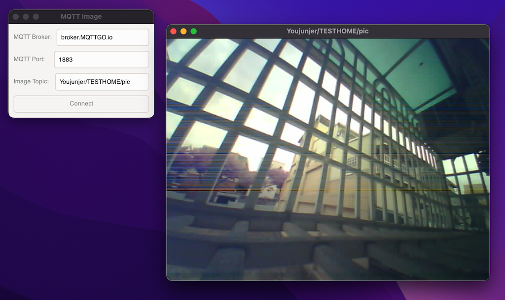

# Show MQTT Image

## Setup

### Install Python-GTK+3

- macOS:
    ```
    $ brew install pygobject3 gtk+3
    ```

- Ubuntu:
    ```
    $ sudo apt install python3-gi python3-gi-cairo gir1.2-gtk-3.0
    ```

### Install Python Package

```
$ pip3 install paho-mqtt
```

## Run Examples

```
$ python3 mqtt_image.py --broker broker.MQTTGO.io --port 1883 --topic Youjunjer/TESTHOME/pic
```

or

```
$ python3 mqtt_image.py -b broker.MQTTGO.io -p 1883 -t Youjunjer/TESTHOME/pic
```



